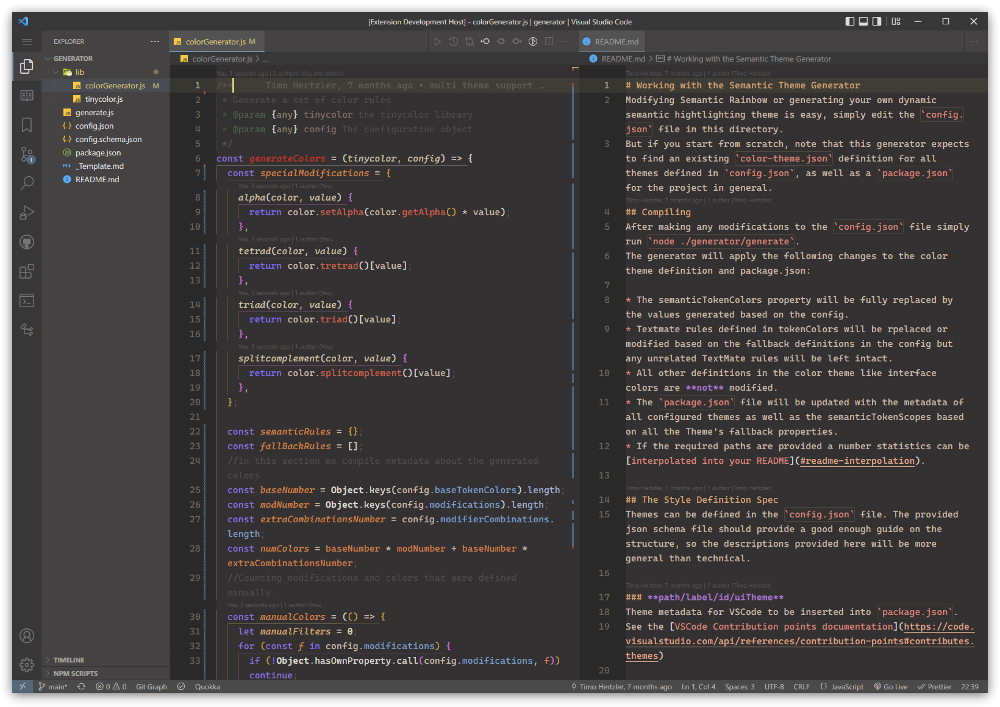

<!--  -->
<!-- # Dark, please! -->

# 

> A pleasant-looking low contrast dark theme for VSCode with semantic highlighting.

## Overview

Plenty of themes offer minimalist highlighting focusing on specific aspects of code using a limited color palette. This theme takes the opposite approach.
Utilizing both bold colors and subtle distinctions, anything than _can_ be identified _will_ be identified.

### List of languages supported:

- JavaScript
- CSS/SCSS
- HTML

### **Main window look**

As of April 2022

### JavaScript

[preview]

### CSS

[preview]

## How it works

Semantic highlighting is programmatically generated, based on a configuration of base colors for the different tokens and a list of specific color transformations for token modifiers which can also be stacked to represent different combinations.  
About 8.63% of styles/transformations are manually defined, stepping in where the automatic generation produced less than optimal results.

The definition of colors and transformations follows a [simple spec](https://github.com/Thertzlor/semantic-rainbow/tree/main/generator#user-content-working-with-the-semantic-theme-generator) for easy tweaking and forking to create any number of dynamic semantic themes.

## Compatibility

This theme relies on the presence of language server that support Semantic Highlighting. Some of the languages with the best support for this feature include JavaScript, TypeScript and Python.  
Keep in mind results might vary based on the language extensions you have installed, and even for non-semantic highlighting the theme attempts to approximate results by providing fallback mappings to TextMate rules including but not limited to the [VSCode semantic token scope map](https://code.visualstudio.com/api/language-extensions/semantic-highlight-guide#semantic-token-scope-map).

<!-- ## Installation -->

<!-- Install from VSCode or via the [Visual Studio Code Marketplace](https://marketplace.visualstudio.com/items?itemName=<...>). -->

## Credits

- [**Eppz! Theme**](https://github.com/Geri-Borbas/VSCode.Extension.eppz_Code) — Styling ideas and color palette reference.
- [**Semantic Rainbow Theme**](https://github.com/Thertzlor/semantic-rainbow/) — Used as a starting point.
- [**Horizon Dark Theme**](https://horizontheme.netlify.app/) — Semantic Rainbow started as an extension of this theme and it remains an influence especially in the non-syntax parts.
- [**TinyColor**](https://github.com/bgrins/TinyColor) — Used for color transformations.
